<p align="center">
  

  
  
  <a href="https://github.com/WebisD/chat-irc-protocol/commits/master">
    
  </a>
  
   
</p>

<!-- PROJECT LOGO -->
<br />
<p align="center">
  <a href="https://github.com/WebisD/chat-irc-protocol">
    
  </a>
</p>

<p align="center">
  
  
  
</p>


<!-- TABLE OF CONTENTS -->
<details open="open">
  <summary>Table of Contents</summary>
  <ol>
    <li>
      <a href="#-about-the-project">About The Project</a>
    </li>
    <li>
      <a href="#-documentation">Documentation</a>
    </li>
    <li>
      <a href="#-how-to-run">How To Run</a>
    </li>
    <li>
      <a href="#-commands">Commands</a>
        <ul>
          <li><a href="#-help">Help</a></li>
          <li><a href="#%EF%B8%8F-register">Register</a></li>
          <li><a href="#-login">Login</a></li>
          <li><a href="#-create">Create</a></li>
          <li><a href="#-list-room">Listroom</a></li>
          <li><a href="#-join">Join</a></li>
          <li><a href="#-message">Message</a></li>
          <li><a href="#-list-users">Listusers</a></li>
          <li><a href="#-leave">Leave</a></li>
          <li><a href="#-logout">Logout</a></li>
          <li><a href="#-quit">Quit</a></li>
        </ul>
    </li>
    <li>
      <a href="#-authors">Authors</a>
    </li>
  </ol>
</details>


<!-- ABOUT THE PROJECT -->
## 💻 About The Project
In this project, we implemented a chat application mirroring that of discord's and whatsapp's main feature: a room to chat with friends.

Our application runs on the terminal using *telnet*.

Our application server was implemented according to the [RFC 1459](https://datatracker.ietf.org/doc/html/rfc1459#section-1.1), which defines the IRC protocol.


<!-- DOCUMENTATION -->
## 📖 Documentation
You can read the code documentation here:   

<a href="https://webisd.github.io/chat-irc-protocol/" target="_blank">
  
</a>


<!-- HOW TO RUN -->
## 🚀 How To Run

⚠️ For a better experience, make the server terminal and client terminal the same size ⚠️

### Server
```bash

# Clone the repository
$ git clone https://github.com/WebisD/chat-irc-protocol.git

# Access the project folder in your terminal / cmd
$ cd chat-irc-protocol

# Download dependencies
$ pip3 install -r requirements.txt

# Enter the main file folder
$ cd src

# Run the application
$ python3 main.py

# The application will open on the port: 8083

```
### Client
```bash

# Use telnet to connect with our server
$ telnet localhost 8083

```

## 🛠 Commands
### 🆘 Help
Type `/help` to see all commands and arguments if needed

The available commands depend on whether you are logged in:

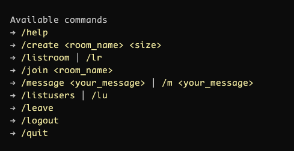

or not:

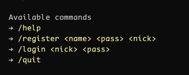


### ®️ Register
Type `/register <name> <nick> <pass>` to register in discord

This needs 3 arguments:

> **name**: your name

> **nick**: your nick name. This will show up for other users

> **pass**: your password. Don't forget this!

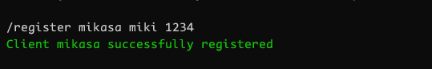

### 🔒 Login
Type `/login <nick> <pass>` to login in Concord

This needs 2 arguments:

> **nick**: your nick name. This will show up for other users

> **pass**: your password. I hope you remember that

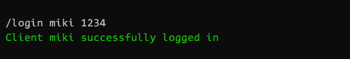

### 🆕 Create
Type `/create <room_name> <size>` to create a new room and chat with your friends

This needs 2 arguments:

> **room_name**: the name of your room. Don't put spaces in the name, use '_' instead

> **size**: maximum number of users who can enter the room

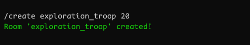

### 📜 List room
Type `/listroom` or `/lr` to list all rooms in Concord

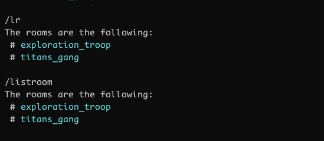

### 🚪 Join
Type `/join <room_name>` to enter in a room

> **room_name**: the name of the room you want to join

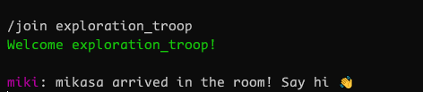

### 💬 Message
Type `/message <your_message>` or `/m <your_message>` to send a message to your friends

> **your_message**: the message you want to send to your friends
 server
Sender's view:


Receiver's view:
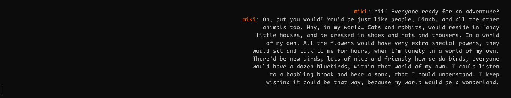

### 📜 List users
Type `/listusers` or `/lu` to list all users in your current place

If you are in a room, this command will only show users in the room

If you are in the lobby, this command will only show users in Concord who are also not in a room

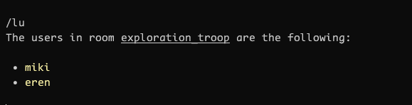

### 🚪 Leave
Type `/leave` to leave the room you are in

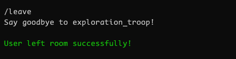

### 🚪 Logout
Type `/logout` to logout of your account

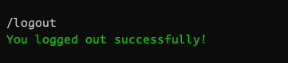

### 🚪 Quit
Type `/Quit` to fully get out of Concord

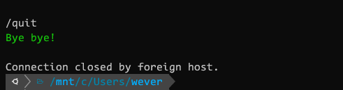

<!-- AUTHORS -->
## 🤖 Authors

[Antonio Gustavo](https://github.com/antuniooh)           |  [João Vitor Dias](https://github.com/JoaoDias-223)           |  [Weverson da Silva](https://github.com/WebisD)
:-------------------------:|:-------------------------:|:-------------------------:
  |  | 
22.119.001-0 | 22.119.006-9 | 22.119.004-4
